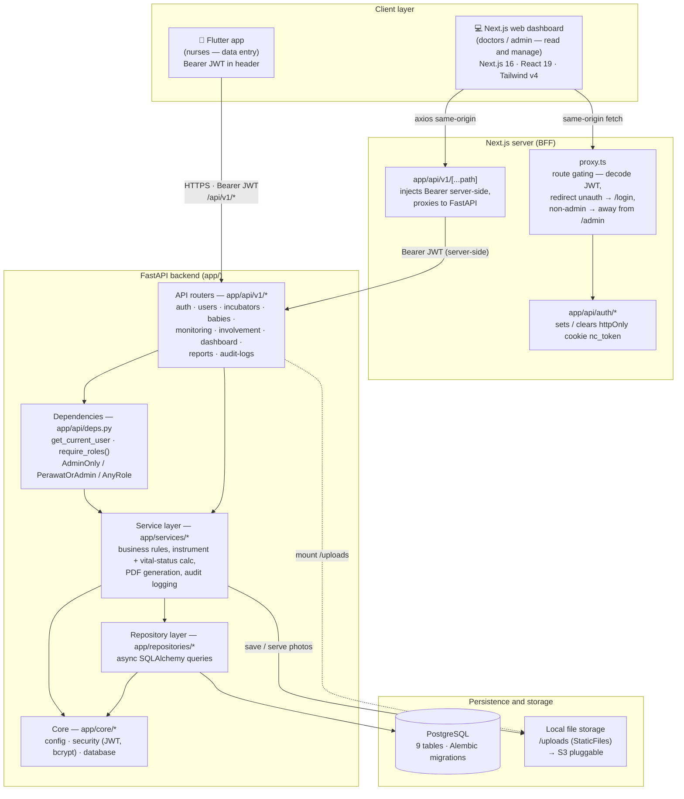
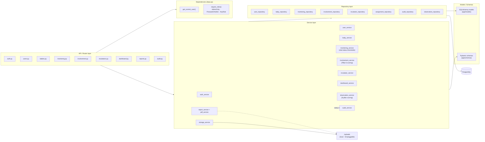
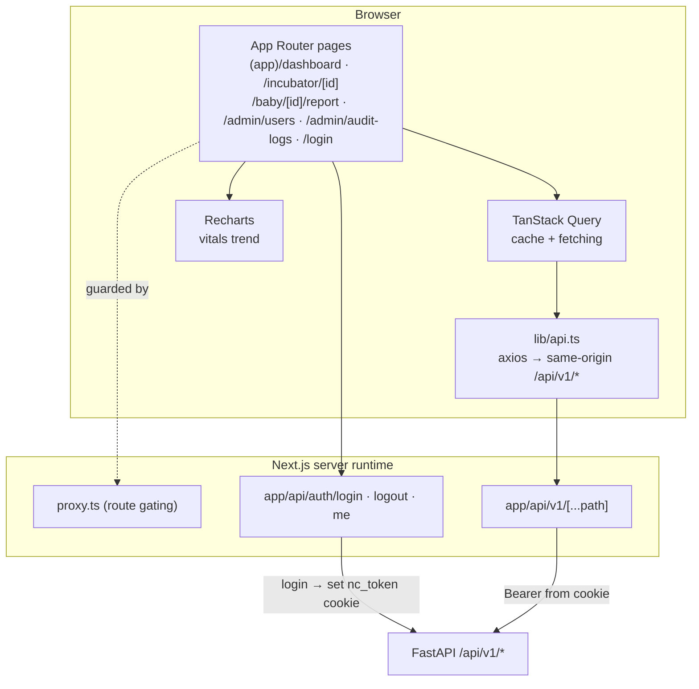

# Component Diagram — Neonatal Care System

System architecture across the three deployables: **Flutter** (mobile data entry),
**Next.js** (web dashboard), and the **FastAPI** backend over **PostgreSQL**.

> **📊 How to view the diagrams.** They're [Mermaid](https://mermaid.js.org/) and render automatically on
> **GitHub** and in **VS Code** (with the *Markdown Preview Mermaid Support* extension → open Preview). If
> you see only raw `flowchart` text, paste the code block into <https://mermaid.live>. Each diagram is
> followed by a plain-text explanation, so you can follow the architecture without rendering.

---

## 1. High-level system architecture

**Two auth strategies, one backend.**

- **Flutter** stores the JWT and sends it as an `Authorization: Bearer …` header on every call.
- **Next.js** uses an **httpOnly-cookie BFF**: the token lives in the `nc_token` cookie (never exposed
  to browser JS). The browser calls same-origin `/api/v1/*`; `app/api/v1/[...path]/route.ts` reads the
  cookie and re-attaches the Bearer when proxying to FastAPI — so there is no CORS exposure and no token
  in client memory.

---

## 2. Backend layered architecture

The backend follows a clean **Router → Service → Repository** layering. Routers never touch the DB
directly; services hold business rules; repositories own all SQLAlchemy.

### Layer responsibilities

| Layer | Directory | Responsibility |
|---|---|---|
| **Router** | `app/api/v1/` | HTTP shape only — path/query/body binding, status codes, response models. Declares the role guard it needs. |
| **Dependencies** | `app/api/deps.py` | Decode JWT → load `User`; `require_roles()` factory builds `AdminOnly`, `PerawatOrAdmin`, `AnyRole`. |
| **Service** | `app/services/` | Business logic: instrument scoring (observation + Pillar-6 involvement), vital-status thresholds + incubator-status side effects, PDF rendering, and **audit logging on every mutation**. |
| **Repository** | `app/repositories/` | All async SQLAlchemy queries; the only layer that touches the session/DB. |
| **Core** | `app/core/` | `config` (env settings), `security` (JWT encode/decode, bcrypt), `database` (async engine + `get_db`). |
| **Models / Schemas** | `app/models`, `app/schemas` | ORM entities vs. Pydantic request/response contracts. |

---

## 3. Web dashboard (Next.js) internal components

**Stack:** Next.js 16.2 (App Router, Turbopack) · React 19 · TypeScript · Tailwind v4
(`@theme` in `app/globals.css`) · TanStack Query · Recharts · Manrope font.
Data-entry forms are intentionally **not** in the web app — registration / monitoring /
involvement entry live in the Flutter client; the web dashboard is read + admin-management.

---

## 4. Technology summary

| Concern | Technology |
|---|---|
| Mobile client | Flutter (Dart) |
| Web client | Next.js 16 · React 19 · TypeScript · Tailwind v4 · TanStack Query · Recharts |
| Backend API | FastAPI (async), Python 3.11+ |
| ORM / migrations | SQLAlchemy 2.0 (async) · Alembic |
| Database | PostgreSQL |
| Auth | JWT (HS256, `python-jose`) · bcrypt (`passlib`) |
| File storage | Local `/uploads` via StaticFiles (S3-pluggable via `storage_service`) |
| PDF reports | `pdf_service` (server-side render) |
| Deployment (planned) | Docker · Nginx · HTTPS/SSL · VPS |
