# Entity Relationship Diagram — Neonatal Care System

> Database: **PostgreSQL** · ORM: **SQLAlchemy 2.0** (async) · Migrations: **Alembic**
> Source of truth: `backend/app/models/`. This document reflects schema revisions up to
> `c3a5e7f20b1d_monitoring_humidity` (8-pillar fields + incubator humidity).

All primary keys are `UUID` (PostgreSQL `uuid` type, generated application-side via `uuid4()`),
except where noted. All timestamps are `TIMESTAMP WITH TIME ZONE`.

> **📊 How to view the diagram below.** It's written in [Mermaid](https://mermaid.js.org/). It renders
> automatically on **GitHub** and in **VS Code** (install the *Markdown Preview Mermaid Support*
> extension, then open Preview). If you only see raw `erDiagram` text, your viewer isn't rendering
> Mermaid — paste the code block into <https://mermaid.live> to see it. The tables in §2 below describe
> every field in plain text, so the diagram is optional.

---

## 1. Diagram

```mermaid
erDiagram
    users ||--o{ baby_incubator_assignments : "assigns (assigned_by)"
    users ||--o{ monitoring_records          : "records (recorded_by)"
    users ||--o{ parent_involvement_records  : "records (recorded_by)"
    users ||--o{ observations                : "records (recorded_by)"
    users ||--o{ audit_logs                  : "performs"

    babies ||--|| parents                     : "has one"
    babies ||--o{ baby_incubator_assignments  : "placed in"
    babies ||--o{ monitoring_records           : "monitored by"
    babies ||--o{ parent_involvement_records   : "engaged in"
    babies ||--o{ observations                 : "assessed by"

    incubators ||--o{ baby_incubator_assignments : "houses"

    users {
        uuid     id PK
        enum     role "admin | perawat | dokter"
        varchar  email UK
        varchar  password_hash
        varchar  full_name
        boolean  is_active
        timestamptz created_at
        timestamptz updated_at
    }

    incubators {
        uuid     incubator_id PK
        varchar  incubator_no UK
        varchar  location "nullable"
        enum     status "kosong | terisi | warning | tidak_tersedia"
        timestamptz created_at
        timestamptz updated_at
    }

    babies {
        uuid     baby_id PK
        varchar  baby_name
        enum     gender "laki_laki | perempuan"
        date     birth_date
        numeric  birth_weight "grams, nullable"
        numeric  birth_length "cm, nullable"
        smallint gestational_age "weeks, nullable"
        varchar  birth_type "nullable"
        text     clinical_notes "nullable"
        boolean  is_active
        timestamptz created_at
        timestamptz updated_at
    }

    parents {
        uuid     parent_id PK
        uuid     baby_id FK,UK "1:1 with babies, ON DELETE CASCADE"
        varchar  mother_name "nullable"
        varchar  father_name "nullable"
        varchar  mother_phone "nullable"
        text     mother_medical_history "nullable"
        text     birth_history "nullable"
        text     delivery_history "nullable"
        text     additional_notes "nullable"
        timestamptz created_at
        timestamptz updated_at
    }

    baby_incubator_assignments {
        uuid     assignment_id PK
        uuid     baby_id FK
        uuid     incubator_id FK
        uuid     assigned_by FK "-> users.id"
        timestamptz assigned_at
        timestamptz discharged_at "nullable"
        enum     status "active | discharged"
    }

    monitoring_records {
        uuid     monitoring_id PK
        uuid     baby_id FK
        uuid     recorded_by FK "-> users.id"
        timestamptz observation_time
        numeric  suhu_bayi "C, nullable"
        numeric  suhu_inkubator "C, nullable"
        numeric  kelembapan_inkubator "%RH, nullable (Pillar 7)"
        smallint heart_rate "bpm, nullable"
        smallint respiratory_rate "breaths/min, nullable (Pillar 1)"
        numeric  spo2 "%, nullable"
        smallint expression_score "1-5, nullable"
        smallint movement_score "1-5, nullable"
        smallint pain_score "0-7 NIPS, nullable (Pillar 6)"
        smallint sleep_duration_min "minutes, nullable (Pillar 5)"
        smallint sleep_quality "1-5, nullable (Pillar 5)"
        smallint agitation_episodes "count, nullable (Pillar 5)"
        text     catatan "nullable"
        varchar  foto_url "nullable"
        timestamptz created_at
    }

    parent_involvement_records {
        uuid     involvement_id PK
        uuid     baby_id FK
        uuid     recorded_by FK "-> users.id"
        timestamptz observation_time
        jsonb    scores "Pillar 6 {keluarga_1..6: 0-3}"
        text     catatan "nullable"
        smallint durasi_menyusui "minutes, nullable"
        smallint durasi_interaksi "minutes, nullable"
        varchar  kondisi_bayi "nullable"
        int      total_score "0-18, computed"
        numeric  percentage "0-100, computed"
        varchar  category "band, computed"
        timestamptz created_at
    }

    observations {
        uuid     observation_id PK
        uuid     baby_id FK
        uuid     recorded_by FK "-> users.id"
        timestamptz observation_time
        jsonb    scores "8-pillar {item_code: 0-3}"
        text     catatan "nullable"
        int      total_score "0-144, computed"
        numeric  percentage "0-100, computed"
        varchar  category "band, computed"
        timestamptz created_at
    }

    audit_logs {
        uuid     log_id PK
        uuid     user_id FK "-> users.id, ON DELETE SET NULL, nullable"
        varchar  action
        varchar  table_name "nullable"
        uuid     record_id "nullable"
        inet     ip_address "nullable"
        jsonb    details "nullable"
        timestamptz created_at
    }
```

---

## 2. Entities

### 2.1 `users`
System accounts. RBAC is enforced from the `role` column.

| Column | Type | Notes |
|---|---|---|
| `id` | UUID | PK |
| `role` | ENUM(`user_role`) | `admin`, `perawat`, `dokter` |
| `email` | VARCHAR(255) | **UNIQUE**, login identity |
| `password_hash` | VARCHAR(255) | bcrypt (passlib) |
| `full_name` | VARCHAR(255) | |
| `is_active` | BOOLEAN | soft-disable; inactive users are rejected at login and on every request |
| `created_at` / `updated_at` | TIMESTAMPTZ | server defaults |

### 2.2 `incubators`
Physical incubator units.

| Column | Type | Notes |
|---|---|---|
| `incubator_id` | UUID | PK |
| `incubator_no` | VARCHAR(10) | **UNIQUE** label, e.g. `INC-01` |
| `location` | VARCHAR(255) | nullable |
| `status` | ENUM(`incubator_status`) | `kosong`, `terisi`, `warning`, `tidak_tersedia` (default `kosong`) |
| `created_at` / `updated_at` | TIMESTAMPTZ | |

### 2.3 `babies`
Neonate master record.

| Column | Type | Notes |
|---|---|---|
| `baby_id` | UUID | PK |
| `baby_name` | VARCHAR(255) | |
| `gender` | ENUM(`gender_type`) | `laki_laki`, `perempuan` |
| `birth_date` | DATE | drives `age_in_days` (computed at API layer) |
| `birth_weight` | NUMERIC(6,2) | grams, nullable |
| `birth_length` | NUMERIC(5,1) | cm, nullable |
| `gestational_age` | SMALLINT | weeks, nullable |
| `birth_type` | VARCHAR(100) | nullable |
| `clinical_notes` | TEXT | nullable |
| `is_active` | BOOLEAN | set `false` on discharge |
| `created_at` / `updated_at` | TIMESTAMPTZ | |

### 2.4 `parents`
Parent / family context — strict **1:1** with a baby (created together during registration).

| Column | Type | Notes |
|---|---|---|
| `parent_id` | UUID | PK |
| `baby_id` | UUID | FK → `babies.baby_id`, **UNIQUE**, `ON DELETE CASCADE` |
| `mother_name`, `father_name`, `mother_phone` | VARCHAR | nullable |
| `mother_medical_history`, `birth_history`, `delivery_history`, `additional_notes` | TEXT | nullable |
| `created_at` / `updated_at` | TIMESTAMPTZ | |

### 2.5 `baby_incubator_assignments`
Join/history table linking a baby to an incubator over time. Only one row per baby should be `active`.

| Column | Type | Notes |
|---|---|---|
| `assignment_id` | UUID | PK |
| `baby_id` | UUID | FK → `babies` |
| `incubator_id` | UUID | FK → `incubators` |
| `assigned_by` | UUID | FK → `users.id` (the nurse/admin who placed the baby) |
| `assigned_at` | TIMESTAMPTZ | |
| `discharged_at` | TIMESTAMPTZ | nullable; set when discharged |
| `status` | ENUM(`assignment_status`) | `active`, `discharged` |

### 2.6 `monitoring_records`
Per-observation vitals + comfort scores. Implements **IFCDC 8-Pillar** fields
(respiratory rate = Pillar 1, sleep = Pillar 5, pain = Pillar 6, humidity = Pillar 7).

Key check constraints (enforced in DB **and** Pydantic):
`expression_score`/`movement_score`/`sleep_quality` ∈ [1,5]; `pain_score` ∈ [0,7].

`vital_status` (`normal`/`warning`) is **derived at runtime** — it is not stored. See [SEQUENCE_DIAGRAMS.md](SEQUENCE_DIAGRAMS.md) §2.

### 2.7 `parent_involvement_records`
Keterlibatan Orang Tua = **Pillar 6 "Kerjasama dengan Keluarga"** (6 items, each **0–3**), stored as
a `JSONB` `scores` map (`{keluarga_1..6: 0-3}`). `total_score` (0–18), `percentage`, and `category`
are computed in the service layer from the fixed catalog. Contextual columns (`durasi_*`,
`kondisi_bayi`, `catatan`) are optional and not scored.

### 2.8 `observations`
The 8-pillar premature-baby instrument (currently 7 pillars / 48 items, each **0–3**), stored as a
`JSONB` `scores` map (`{item_code: 0-3}`). `total_score` (0–144), `percentage`, and `category` are
computed from the catalog. Any item scored **0** flips the baby's active incubator to `warning`.
Banding (both instruments): ≥85 Sangat Baik · 70–84 Baik · 55–69 Cukup · 40–54 Kurang · <40 Sangat Kurang.

### 2.9 `audit_logs`
Append-only trail. `user_id` is `ON DELETE SET NULL` so the trail survives user deletion.
`details` is a flexible `JSONB` payload; `ip_address` uses the native `INET` type.

---

## 3. Relationship summary

| Parent | Child | Cardinality | FK | On delete |
|---|---|---|---|---|
| `babies` | `parents` | 1 : 1 | `parents.baby_id` | CASCADE |
| `babies` | `baby_incubator_assignments` | 1 : N | `baby_id` | — |
| `incubators` | `baby_incubator_assignments` | 1 : N | `incubator_id` | — |
| `users` | `baby_incubator_assignments` | 1 : N | `assigned_by` | — |
| `babies` | `monitoring_records` | 1 : N | `baby_id` | — |
| `users` | `monitoring_records` | 1 : N | `recorded_by` | — |
| `babies` | `parent_involvement_records` | 1 : N | `baby_id` | — |
| `users` | `parent_involvement_records` | 1 : N | `recorded_by` | — |
| `babies` | `observations` | 1 : N | `baby_id` | — |
| `users` | `observations` | 1 : N | `recorded_by` | — |
| `users` | `audit_logs` | 1 : N | `user_id` | SET NULL |

---

## 4. Enumerated types

| PostgreSQL enum | Values |
|---|---|
| `user_role` | `admin`, `perawat`, `dokter` |
| `incubator_status` | `kosong`, `terisi`, `warning`, `tidak_tersedia` |
| `gender_type` | `laki_laki`, `perempuan` |
| `assignment_status` | `active`, `discharged` |
