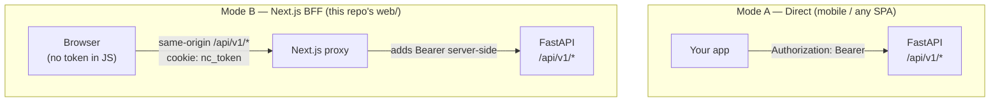

# Getting Started — Frontend Integration Guide

A practical, copy-paste walkthrough for **frontend developers** consuming the Neonatal Care System
API. If you just want the endpoint reference, see [API.md](API.md). Ready-to-use TypeScript types are
in [api-types.ts](api-types.ts).

---

## 1. The mental model: two ways to talk to the API

There are **two integration modes**. Pick the one that matches your client — they hit the same FastAPI
backend but handle the token differently.



| | **Mode A — Direct** | **Mode B — Next.js BFF** |
|---|---|---|
| Who | Flutter app, mobile, any standalone SPA | The `web/` Next.js dashboard |
| Where the token lives | In your app (memory / secure storage) | In an **httpOnly cookie** — never visible to JS |
| How you authenticate calls | You set `Authorization: Bearer <token>` yourself | Automatic — the Next.js proxy injects it |
| Base URL | `http://<host>:8000/api/v1` | same-origin `/api/v1` |

> **Most of this guide is Mode A** (you manage the token). Mode B is covered in §6 — if you're working
> inside this repo's `web/` app, the token handling is already done for you; you just call `/api/v1/*`.

---

## 2. Step 1 — Log in and get a token

`POST /api/v1/auth/login` with email + password. You get back a JWT (`access_token`).

```ts
import type { LoginResponse } from "./api-types";

const BASE_URL = "http://localhost:8000/api/v1";

async function login(email: string, password: string): Promise<LoginResponse> {
  const res = await fetch(`${BASE_URL}/auth/login`, {
    method: "POST",
    headers: { "Content-Type": "application/json" },
    body: JSON.stringify({ email, password }),
  });
  if (!res.ok) {
    const err = await res.json().catch(() => ({}));
    throw new Error(err.detail ?? "Login gagal"); // e.g. "Email atau password salah"
  }
  return res.json();
}
```

**Example response:**
```json
{
  "access_token": "eyJhbGciOiJIUzI1NiIsInR5cCI6IkpXVCJ9.eyJzdWIiOiI2ZjFjMWIyZS04YTNkLi4u...",
  "token_type": "bearer",
  "user_id": "6f1c1b2e-8a3d-4e21-b9c7-2f5a1d0e9b8a",
  "full_name": "Suster Ani",
  "role": "perawat"
}
```

Store `access_token` (and `role`, handy for UI gating — see §7). The token expires after **8 hours**.

---

## 3. Step 2 — Call authenticated endpoints

Every other endpoint needs the token in the `Authorization` header:

```ts
const res = await fetch(`${BASE_URL}/dashboard`, {
  headers: { Authorization: `Bearer ${token}` },
});
```

### A small typed client (recommended)

Wrap it once so you never forget the header and get typed results:

```ts
// api.ts
import type { ApiError } from "./api-types";

const BASE_URL = "http://localhost:8000/api/v1";
let token: string | null = null;
export const setToken = (t: string | null) => { token = t; };

export async function apiFetch<T>(path: string, init: RequestInit = {}): Promise<T> {
  const res = await fetch(`${BASE_URL}${path}`, {
    ...init,
    headers: {
      "Content-Type": "application/json",
      ...(token ? { Authorization: `Bearer ${token}` } : {}),
      ...init.headers,
    },
  });

  if (res.status === 401) throw new Error("UNAUTHORIZED");      // token missing/expired → re-login
  if (res.status === 204) return undefined as T;                // no body
  const body = await res.json().catch(() => null);
  if (!res.ok) throw new Error(messageFrom(body as ApiError));
  return body as T;
}

function messageFrom(err: ApiError | null): string {
  if (!err) return "Terjadi kesalahan";
  if (typeof err.detail === "string") return err.detail;        // app error
  return err.detail?.[0]?.msg ?? "Validasi gagal";              // 422 field error
}
```

Now calls are one-liners and fully typed:

```ts
import type { DashboardResponse, BabyDetailResponse } from "./api-types";

const dashboard = await apiFetch<DashboardResponse>("/dashboard");
const baby      = await apiFetch<BabyDetailResponse>(`/babies/${babyId}`);
```

### Axios variant

```ts
import axios from "axios";
const api = axios.create({ baseURL: "http://localhost:8000/api/v1" });
api.interceptors.request.use((config) => {
  if (token) config.headers.Authorization = `Bearer ${token}`;
  return config;
});
```

---

## 4. Step 3 — Handle errors & expiry

All errors share one envelope: `{ "detail": ... }`.

| Status | What it means for you |
|---|---|
| `401` | Token missing/expired/invalid → clear token, redirect to login |
| `403` | Logged in but role not allowed → hide/disable that action in the UI |
| `404` | Resource gone → show "tidak ditemukan" |
| `409` | State conflict (e.g. incubator already occupied) → show `detail` to user |
| `422` | Validation failed → `detail` is an **array** of field errors |

```jsonc
// 422 example — detail is an array, not a string
{ "detail": [ { "loc": ["body", "pain_score"], "msg": "Pain score harus antara 0 dan 7", "type": "value_error" } ] }
```

The `messageFrom()` helper in §3 already normalizes both shapes into a single string.

---

## 5. Common recipes

### 5.1 Load the dashboard board
```ts
import type { DashboardResponse } from "./api-types";
const data = await apiFetch<DashboardResponse>("/dashboard");
// data.stats → { total, terisi, kosong, warning, tidak_tersedia }
// data.incubators[] → each has current_baby + latest_vitals (both may be null)
```

### 5.2 Submit a monitoring record (and read back the alert)
You send vitals; the server computes `vital_status` (`"normal"` / `"warning"`) and returns it. You do
**not** send `vital_status` — just render what comes back.

```ts
import type { MonitoringCreateRequest, MonitoringResponse } from "./api-types";

const payload: MonitoringCreateRequest = {
  observation_time: new Date().toISOString(),
  suhu_bayi: 36.8, heart_rate: 140, spo2: 97, respiratory_rate: 48, pain_score: 1,
};
const rec = await apiFetch<MonitoringResponse>(`/babies/${babyId}/monitoring`, {
  method: "POST",
  body: JSON.stringify(payload),
});
if (rec.vital_status === "warning") showAlertBadge();
```
Thresholds that trigger `"warning"`: HR outside 100–160, RR outside 40–60, SpO₂ < 93, temp outside
36.0–37.5 °C, or pain ≥ 4.

### 5.3 Upload a monitoring photo (multipart — **no** JSON header)
```ts
const form = new FormData();
form.append("file", fileInput.files![0]);
const res = await fetch(`${BASE_URL}/monitoring/${monitoringId}/photo`, {
  method: "POST",
  headers: { Authorization: `Bearer ${token}` }, // do NOT set Content-Type; browser sets the boundary
  body: form,
});
const { foto_url } = await res.json(); // e.g. "/uploads/<baby>/<id>.jpg" — prefix with backend host to display
```

### 5.4 Download the report PDF
The PDF endpoint accepts the token as a **query param** (so you can use it in an `<a href>` or
`window.open`, which can't set headers):

```ts
window.open(`${BASE_URL}/babies/${babyId}/report/pdf?token=${encodeURIComponent(token)}`);
```

### 5.5 Submit a Pillar-6 involvement record (and read the score back)
`Keterlibatan Orang Tua` is **Pillar 6 "Kerjasama dengan Keluarga"** of the instrument. Fetch the
6-item catalog, send a `scores` map (`item_code` → 0–3); the server returns `percentage`, `category`,
a per-item breakdown, and `alarms` (items scored 0–1). You do **not** compute the score client-side.

```ts
import type { InvolvementCatalog, InvolvementResponse } from "./api-types";

const catalog = await apiFetch<InvolvementCatalog>("/involvement/catalog");
// build scores from your form; here everything = 3 as a placeholder:
const scores = Object.fromEntries(catalog.items.map((it) => [it.item_code, 3]));

const rec = await apiFetch<InvolvementResponse>(`/babies/${babyId}/involvement`, {
  method: "POST",
  body: JSON.stringify({ observation_time: new Date().toISOString(), scores }),
});
// rec.percentage (0–100) · rec.category ("Sangat Baik".."Sangat Kurang")
// rec.items → radar/bars · rec.alarms → items needing attention
```

The **8-pillar Observation** works identically: `GET /observation/catalog` → `POST /babies/{id}/observation`
with a `scores` map. Its response adds per-pillar `pillars`, and any item scored **0** flips the baby's
incubator to `warning`.

---

## 6. Mode B — using the Next.js BFF (this repo's `web/`)

Inside `web/`, the token is **never** in the browser. Flow:

1. `POST /api/auth/login` (a Next.js route handler) → calls FastAPI, then sets the `nc_token`
   **httpOnly cookie**. Use the provided `loginRequest()` in `web/lib/api.ts`.
2. For data, call **same-origin** `/api/v1/*` via the axios instance in `web/lib/api.ts`. The catch-all
   proxy `app/api/v1/[...path]/route.ts` reads the cookie and adds the `Bearer` header server-side.
3. `GET /api/auth/me` tells you who's logged in; `proxy.ts` already redirects unauthenticated users to
   `/login` and non-admins away from `/admin`.

So in Mode B you **don't** manage tokens or set `Authorization` — just `api.get("/dashboard")`.

---

## 7. Gotchas worth knowing up front

- **All fields are `snake_case`** (e.g. `baby_name`, `vital_status`) — they're passed straight through
  from the backend. Don't camelCase them.
- **`role`-based UI:** `dokter` is read-only; `perawat`/`admin` can write; `admin`-only screens are users
  & audit logs. Gate buttons on `role` to avoid surprise `403`s. (The API still enforces this server-side.)
- **Nullable everywhere:** most response fields can be `null` (a baby may have no vitals yet, an incubator
  may be empty). The types in [api-types.ts](api-types.ts) mark these as `T | null` — handle them.
- **Numbers vs strings:** ids and timestamps are strings; weights/temps/scores are JSON numbers.
- **Timestamps are ISO-8601 with timezone** — parse with `new Date(...)`; send `observation_time` the
  same way (`new Date().toISOString()`).
- **Registration is one call:** `POST /babies` creates baby + parent + incubator assignment together and
  needs a `kosong` incubator (else `409`). Get available ones from `GET /incubators/available`.

---

## 8. Quick endpoint cheat-sheet

| I want to… | Call |
|---|---|
| Log in | `POST /auth/login` |
| Know who I am | `GET /auth/me` |
| Show the ward board | `GET /dashboard` |
| List / pick a free incubator | `GET /incubators` · `GET /incubators/available` |
| Register a baby | `POST /babies` |
| Open a baby's detail | `GET /babies/{id}` |
| Add vitals | `POST /babies/{id}/monitoring` |
| Add a photo | `POST /monitoring/{id}/photo` |
| Log parent involvement (Pillar 6) | `GET /involvement/catalog` · `POST /babies/{id}/involvement` |
| Log 8-pillar observation | `GET /observation/catalog` · `POST /babies/{id}/observation` |
| Show report / trends | `GET /babies/{id}/report` |
| Download PDF | `GET /babies/{id}/report/pdf?token=…` |
| Discharge | `POST /babies/{id}/discharge` |
| Manage users (admin) | `GET/POST/PUT /users …` |
| Audit trail (admin) | `GET /audit-logs` |

Full request/response detail for each → [API.md](API.md).
