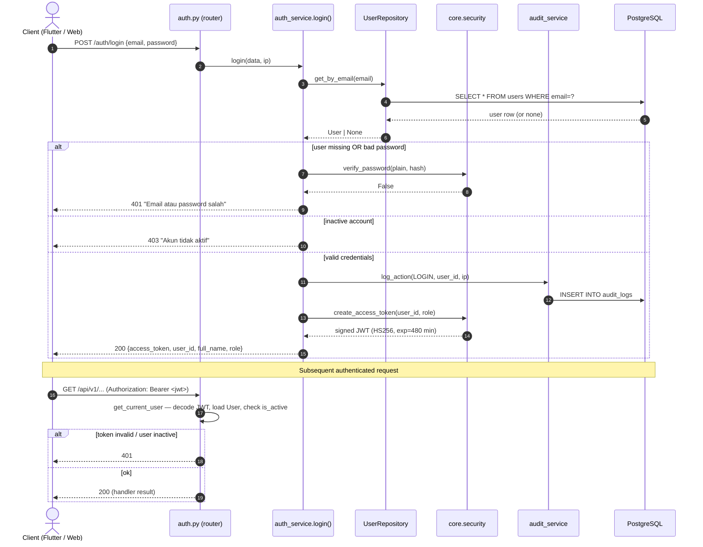
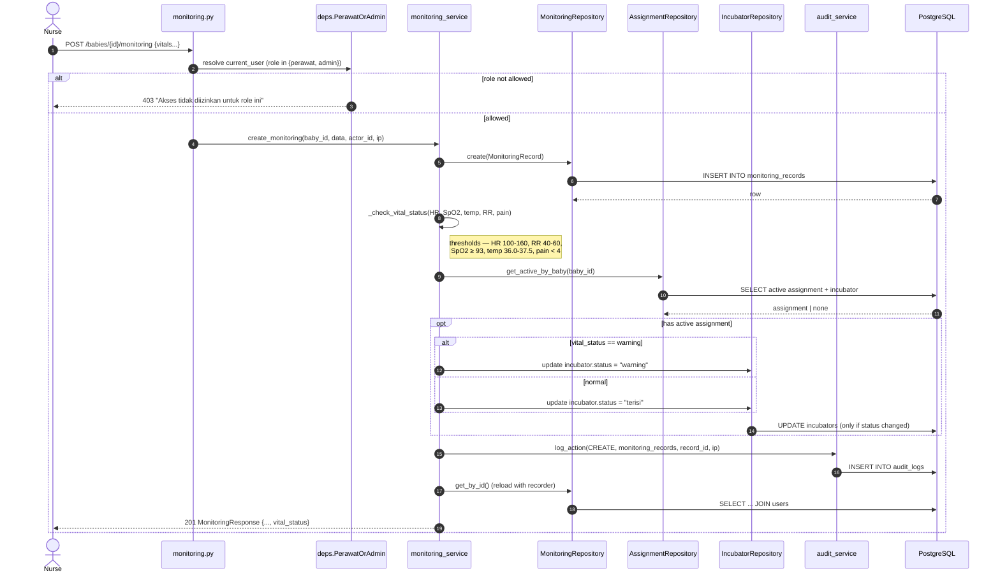
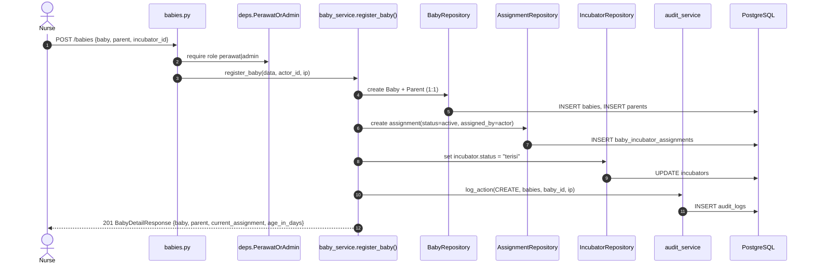
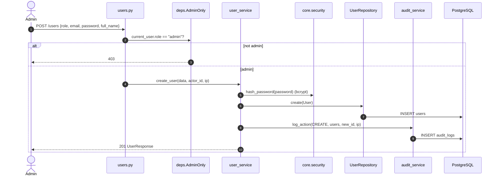

# Sequence Diagrams — Neonatal Care System

API request flows for the core scenarios. Each diagram traces a request through the
**Router → Dependency (auth/RBAC) → Service → Repository → PostgreSQL** layers described in
[COMPONENT_DIAGRAM.md](COMPONENT_DIAGRAM.md).

> **📊 How to view the diagrams.** They're [Mermaid](https://mermaid.js.org/) sequence diagrams — they
> render automatically on **GitHub** and in **VS Code** (with the *Markdown Preview Mermaid Support*
> extension → open Preview). If you only see raw `sequenceDiagram` text, paste the code block into
> <https://mermaid.live>. Notes and tables under each diagram summarize the flow in plain text.

---

## 1. Authentication — Login & authenticated request

`POST /api/v1/auth/login` issues a JWT; every subsequent call is verified by `get_current_user`.



> **Web (Next.js) variant:** the browser never holds the token. `app/api/auth/login` calls FastAPI,
> then stores the JWT in an **httpOnly cookie** (`nc_token`). Later calls go to same-origin
> `/api/v1/[...path]`, which reads the cookie and re-attaches the `Bearer` header server-side.

---

## 2. Create monitoring record — with vital-status evaluation & incubator side effect

`POST /api/v1/babies/{baby_id}/monitoring` — the richest flow. A `perawat`/`admin` submits vitals;
the service derives a `normal`/`warning` status and **propagates it to the incubator**.



**Vital thresholds** (`monitoring_service._check_vital_status`): any breach → `warning`.

| Vital | Normal range |
|---|---|
| Heart rate | 100–160 bpm |
| Respiratory rate | 40–60 breaths/min |
| SpO₂ | ≥ 93 % |
| Baby temperature | 36.0–37.5 °C |
| Pain score (NIPS) | < 4 |

`vital_status` is **computed, never stored** — recomputed on every read so threshold tuning needs no migration.

---

## 3. Register baby — baby + parent + incubator assignment (one transaction)

`POST /api/v1/babies` creates three related rows together and flips the incubator to `terisi`.



---

## 4. Parent involvement — Pillar 6 scoring

`POST /api/v1/babies/{baby_id}/involvement` — Keterlibatan Orang Tua = **Pillar 6 "Kerjasama dengan
Keluarga"** (6 items, each 0–3). The service computes `total_score` (0–18), `percentage`, and a
`category` band from the catalog, plus a per-item breakdown and alarms.

```mermaid
sequenceDiagram
    autonumber
    actor Nurse
    participant API as involvement.py
    participant Svc as involvement_service
    participant Repo as InvolvementRepository
    participant Audit as audit_service
    participant DB as PostgreSQL

    Nurse->>API: POST /babies/{id}/involvement {scores {keluarga_1..6: 0-3}, context}
    API->>Svc: create_involvement(baby_id, data, actor_id, ip)
    Svc->>Svc: total = sum(scores); percentage = round(total / 18 * 100, 1)
    Svc->>Svc: category band; alarms = items scored 0-1
    Svc->>Repo: create(record incl. scores, total_score, percentage, category)
    Repo->>DB: INSERT parent_involvement_records
    Svc->>Audit: log_action(CREATE, parent_involvement_records, id, ip)
    Audit->>DB: INSERT audit_logs
    Svc-->>Nurse: 201 InvolvementResponse {percentage, category, items[], alarms[]}
```

**Category bands (both instruments):** ≥85% Sangat Baik · 70–84% Baik · 55–69% Cukup · 40–54% Kurang · <40% Sangat Kurang.

---

## 5. Baby report PDF — dual auth (header **or** `?token=`)

`GET /api/v1/babies/{baby_id}/report/pdf` supports a query-param token because browser download
launchers (`url_launcher`) cannot set an `Authorization` header.

```mermaid
sequenceDiagram
    autonumber
    actor User as Doctor / Nurse
    participant API as reports.py
    participant Sec as core.security
    participant URepo as UserRepository
    participant RSvc as report_service
    participant PSvc as pdf_service
    participant DB as PostgreSQL

    User->>API: GET /babies/{id}/report/pdf  (Bearer header OR ?token=)
    API->>API: pick raw_token (header credentials → else query token)
    alt no token
        API-->>User: 401 "Not authenticated"
    else token present
        API->>Sec: decode_access_token(raw_token)
        Sec-->>API: payload {sub, role} | {}
        alt invalid / user inactive
            API->>URepo: get_by_id(sub)
            URepo->>DB: SELECT user
            API-->>User: 401
        else valid
            API->>RSvc: get_baby_report(baby_id)
            RSvc->>DB: SELECT baby + monitoring + involvement (+ summary)
            RSvc-->>API: BabyReportResponse
            API->>PSvc: generate_pdf(report)
            PSvc-->>API: pdf bytes
            API-->>User: 200 application/pdf<br/>Content-Disposition: attachment; laporan_<name>.pdf
        end
    end
```

---

## 6. Admin — create user (RBAC + audit)

`POST /api/v1/users` is gated to `admin` via the `AdminOnly` dependency; the mutation is audit-logged.



---

## Cross-cutting notes

- **Every mutating endpoint** (login, create/update/delete, photo upload, discharge) calls
  `audit_service.log_action(...)`, capturing actor, action, table, record id, IP, and a JSON `details`
  payload — see §2.8 of [ERD.md](ERD.md).
- **Role guards** resolve *before* the handler body runs, so an unauthorized caller never reaches the
  service/DB layer. Guards: `AnyRole` (any authenticated), `PerawatOrAdmin`, `AdminOnly`.
- **Client IP** is read from `request.client.host` in the router and threaded through to the audit log.
